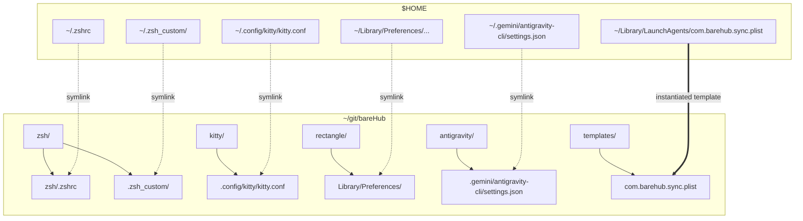
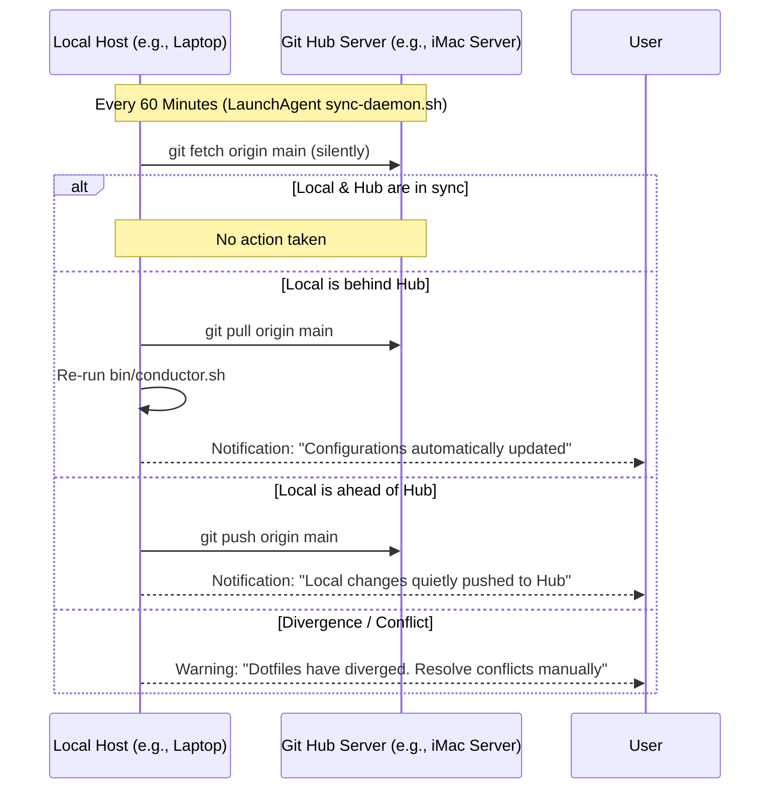

# 🐻 bareHub

A modular, host-conditional, and security-first dotfiles and environment automation framework built for macOS.

`bareHub` provides a frictionless way to bootstrap, stow, and sync system configurations across multiple machines (e.g., desktops, laptops, and servers) using **GNU Stow** and a Tailscale-enabled background synchronization loop.

---

## 🌟 Inspiration & Credits

`bareHub` is deeply inspired by **Gemini Conductor**, an advanced AI-driven environment orchestration paradigm. We "pay it forward" to the Conductor design by maintaining `conductor.sh` as our core bootstrapper, extending its philosophies of declarative state management, modular configuration, and elegant host-conditional execution.

---

## 📐 Architecture & Core Concepts

At its heart, `bareHub` decouples your physical home directory (`~`) from your configuration files using standard symbolic links managed by **GNU Stow**.



### 1. The Modular Bootstrapper (`conductor.sh`)
The `bin/conductor.sh` script is the entry point. It parses a machine-specific profile (`~/.dotfiles.profile`) to determine which configuration packages (e.g., `zsh`, `kitty`, `rectangle`, `antigravity`) to stow on the current host. This keeps your configurations portable, lightweight, and host-adaptive.

### 2. Tailscale Bidirectional Sync Loop
To keep multiple machines seamlessly aligned, `bareHub` utilizes an hourly LaunchAgent daemon (`com.barehub.sync.plist`) executing a bidirectional Git sync loop over **Tailscale**:



---

## 🔒 Security & Secrets Isolation

A major tenet of `bareHub` is **zero leakage of private credentials, API tokens, or computer usernames** into public repositories:

* **Dynamic Home Path Substitution**: The background sync LaunchAgent template contains `__HOME__` placeholders. The `conductor.sh` bootstrapper dynamically instantiates a non-symlinked, localized version (`~/Library/LaunchAgents/com.barehub.sync.plist`) during installation. This protects your private username (`/Users/__USER__`) from git history.
* **GCP Secrets Integration**: Active production secrets are stored in GCP Bucket Storage and resolved at shell startup using `berglas` IAM authentication. No raw passwords or API keys are ever committed to Git.
* **Fallback Degradation**: Custom Zsh modules check for the presence of CLI tools (`gcloud`, `pyenv`, `rustup`) and degrade silently if they are missing, ensuring error-free shell load on minimal machines.
* **Dynamic Bootstrapper Resolution**: `conductor.sh` dynamically resolves its execution path (`$BAREHUB_DIR`), allowing users to clone the framework anywhere without breaking paths.

---

## 🎭 The Private Overlay Architecture

While `bareHub` manages the public, universal core environment, many users have highly personal or proprietary configurations (private aliases, work-specific tools, personal Git identities) that should never touch a public repository. 

To solve this, `bareHub` natively supports a **Private Overlay Architecture**.

If a secondary private repository exists at `~/git/dotfiles`, the Conductor will automatically detect it and perform a secondary Stow pass on overlay directories (e.g., `zsh-private` and `git-private`). 

### Example Overlay Integration
1. **Git Identity:** The public `bareHub` `.gitconfig` contains an `[include]` directive pointing to `~/.gitconfig.local`. Your private overlay can stow a `git-private/.gitconfig.local` containing your actual name and email.
2. **Private Aliases:** The public `.zshrc` automatically sources anything found in `~/.zsh_custom_private`. Your private overlay can stow a `zsh-private/.zsh_custom_private/private-aliases.zsh` to silently inject proprietary toolpaths (like `antigravity` SDK paths) or work VPN aliases into the public environment.

This architecture ensures a strict separation of concerns: `bareHub` handles the public routing, while your private `dotfiles` handles the proprietary secrets.

---

## 🚀 Getting Started

### 1. Define Your Profile
Create a machine-specific profile at `~/.dotfiles.profile` to configure which features are enabled on this host:

```bash
# Enabled features on this host
export DOTFILES_ENABLED_FEATURES=(zsh git themes kitty rectangle)
```

### 2. Run the Conductor
Run the bootstrapper to install missing dependencies (via Homebrew), stow packages, and load your custom shell environment:

```bash
./bin/conductor.sh
```

---

## 📄 License

This project is licensed under the **GNU GPLv3** license. Feel free to copy, modify, and distribute it, but please maintain the "pay-it-forward" spirit of open source!
